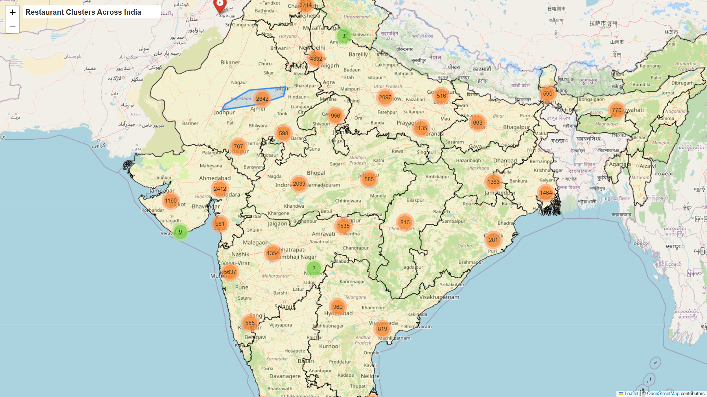
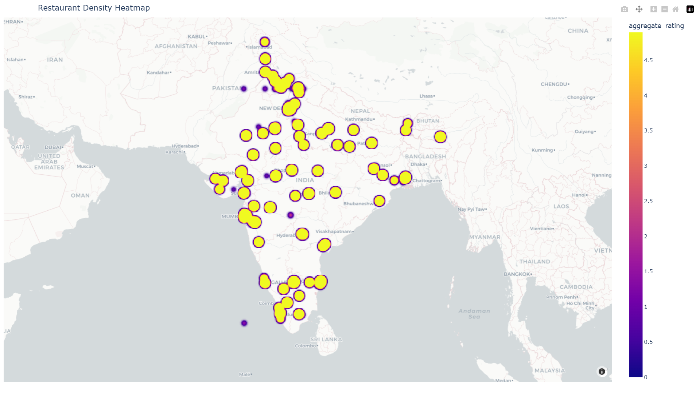
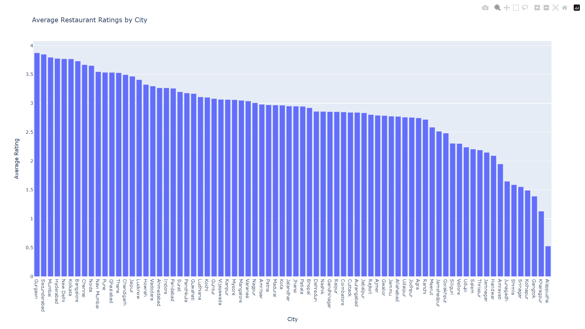
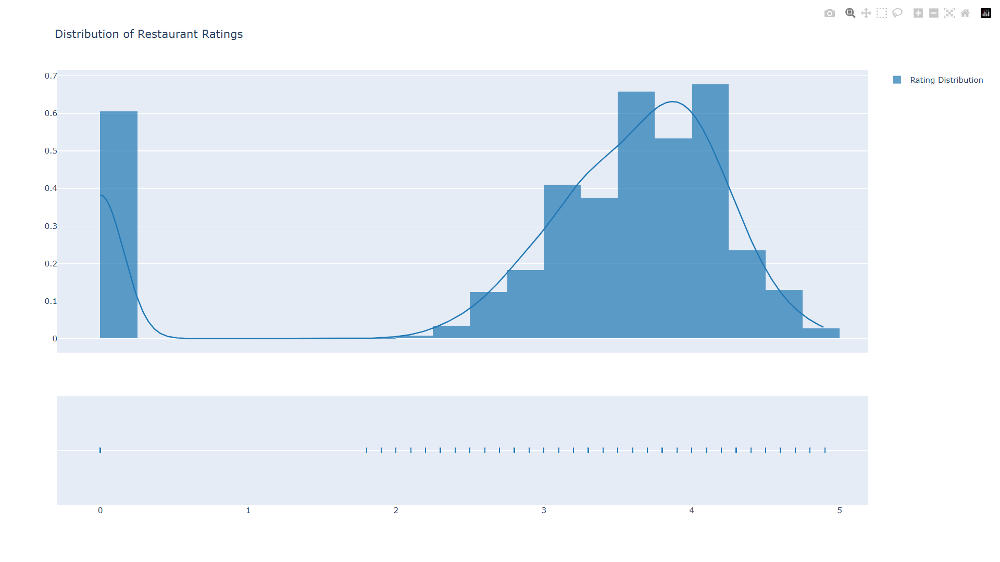
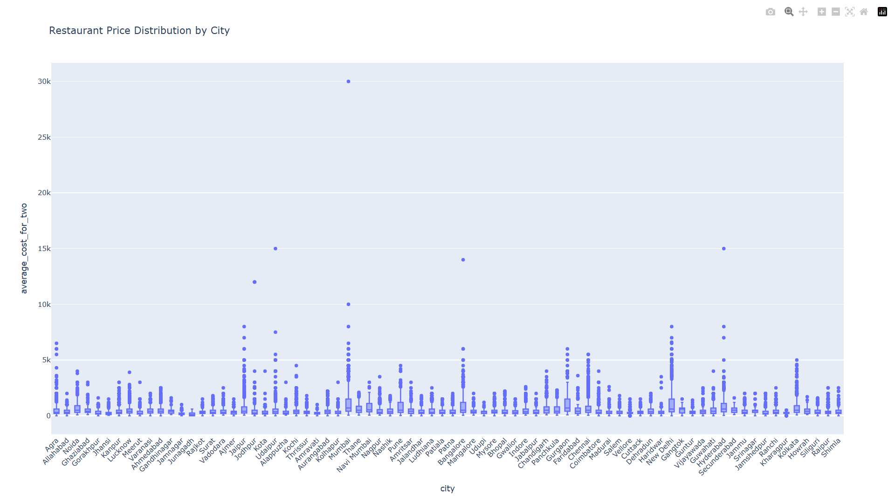
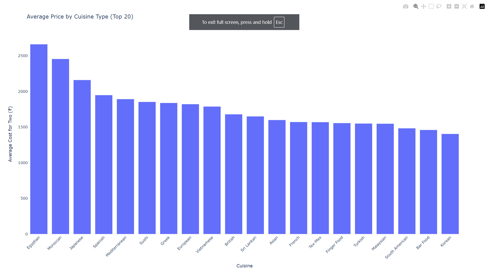
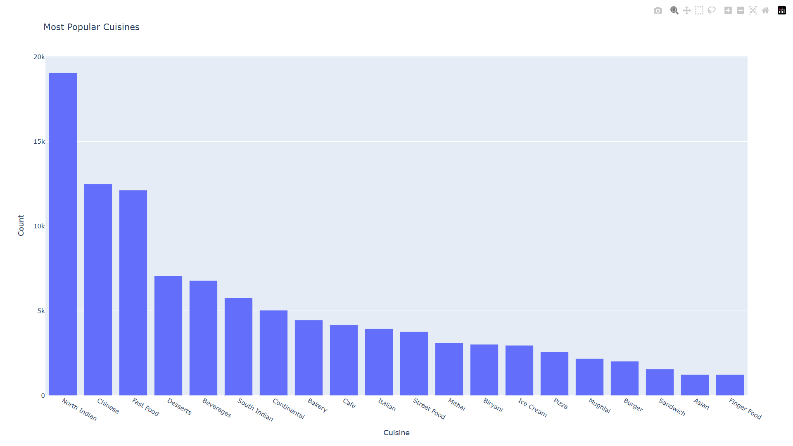

# Location-Based Restaurant Analysis

## Overview
This project provides an interactive analysis of restaurant data based on location, ratings, cost, and cuisines. It utilizes data visualization techniques to generate meaningful insights, including interactive maps and statistical visualizations.

## Features
- **Interactive Map**: Displays restaurant locations with rating-based markers.
- **Heatmap Analysis**: Shows restaurant density based on location and ratings.
- **Statistical Insights**: Visualizes restaurant ratings, price distributions, and cuisine popularity.
- **Correlation Analysis**: Examines relationships between different restaurant attributes.

## Technologies Used
- **Programming Language**: Python
- **Data Processing**: Pandas, NumPy
- **Visualization**: Folium, Plotly, Matplotlib, Seaborn
- **Statistical Analysis**: SciPy, Statsmodels

## Installation
1. Clone the repository:
    ```sh
    git clone https://github.com/your-username/location-based-restaurant-analysis.git
    ```
2. Navigate to the project directory:
    ```sh
    cd location-based-restaurant-analysis
    ```
3. Install required dependencies:
    ```sh
    pip install -r requirements.txt
    ```
4. Run the analysis script:
    ```sh
    python main.py
    ```

## Screenshots
### Interactive Map


### Restaurant Density Analysis


### Rating Analysis



### Price Analysis


### Cuisine Popularity



## Usage
- **Modify Data**: Replace `data.csv` with your dataset to analyze a different set of restaurants.
- **Customize Visualizations**: Modify the `create_visualizations()` function in `main.py`.
- **Run on a Web Server**: Use Flask to serve the interactive visualizations.

## License
This project is licensed under the MIT License. See `LICENSE` for details.

## Author
Developed by [Your Name]. Feel free to contribute or reach out for improvements!

